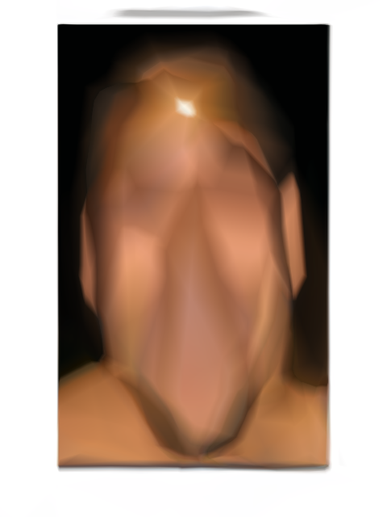
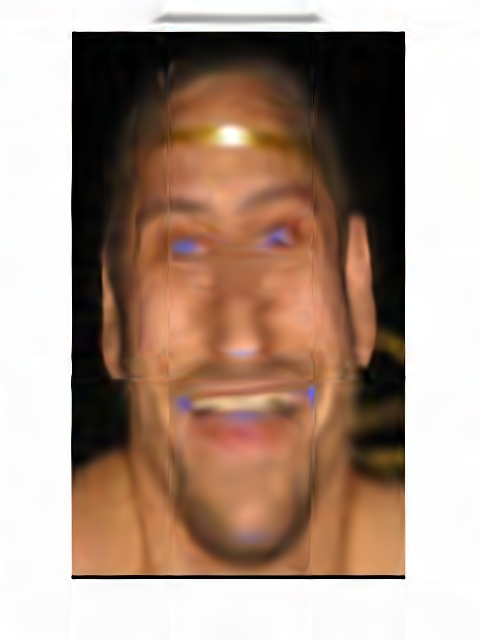
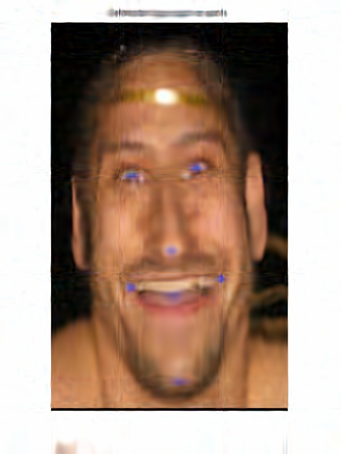

# Implicit representations and NERF

---
# Implicit representations

What is an image?

---
# Implicit representations

What is an image?

$$I(x,y) \to (r,g,b)$$

[Neural-networks are universal approximators](https://cognitivemedium.com/magic_paper/assets/Hornik.pdf) (Hornik).
Let's train a neural network representing $I$.

---
# Implicit representations

- Samples: $\left\{(x,y)_i, (r,g,b)_i\right\}$
- Neural-network: MLP 5x32
- Loss: MSE
- Optimizer: Adam
- Epochs: 50

---
# Implicit representations results
(see the code)

---
# Implicit representations

Why the reconstruction is bad?

[DNNs are biased to learn low frequencies](https://arxiv.org/pdf/1806.08734.pdf) (Rahaman).

---
# Positional encoding

- We are combining ReLUs.
- Let's combine **sinusoidal functions**:
  - map $x \to \{\sin(2^i\pi x), \cos(2^i\pi x)\}_i$;
  - same for $y$, use all $(x,y)$ and their mappings.

---
# Positional encoding results
(see the code)

---
# SIREN

What about using sinusoids as activations?

[Fourier Neural Networks](https://arxiv.org/pdf/1902.03011.pdf) are there since 1999!

---
# SIREN

- Sinusoidal activation functions.
  - Sinusoids derive to sinusoids.
  - Derivative of SIREN is a SIREN.
  - Can fit any derivative (including zero).
- Need careful initialization.

---
# SIREN results
(see the code)

---
# SIREN

- [1d, 2d, 3d](https://www.vincentsitzmann.com/siren/);
- fitting [gradient and laplacian](https://miro.medium.com/max/1400/0*l7VjThctJvOGLDsF.png) too;
- generalizes via [hyper-network](https://pbs.twimg.com/ext_tw_video_thumb/1274121310193348608/pu/img/eLkSoZ4Gr351nsma?format=jpg&name=large).
