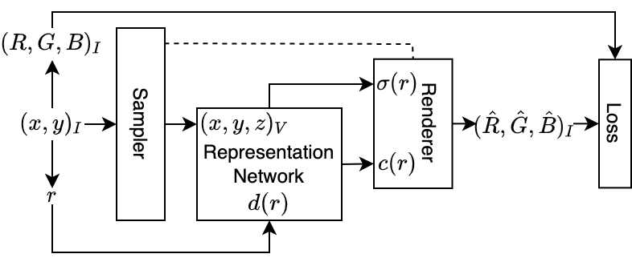
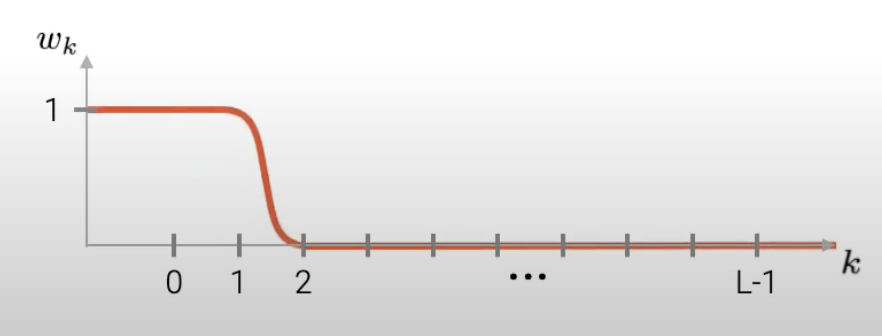

# Implicit representations and NeRF

---
# Implicit representations

What is an image?

---
# Implicit representations

What is an image?

$$I(x,y) \to (r,g,b)$$

[Neural-networks are universal approximators](https://cognitivemedium.com/magic_paper/assets/Hornik.pdf) (Hornik).
Let's train a neural network representing $I$.

---
# Implicit representations

- Samples: $\left\{(x,y)_i, (r,g,b)_i\right\}$
- Neural-network: MLP 5x32
- Loss: MSE
- Optimizer: Adam
- Epochs: 50

(see the code)

---
# Implicit representations

Why the reconstruction is bad?

[DNNs are biased to learn low frequencies](https://arxiv.org/pdf/1806.08734.pdf) (Rahaman).

---
# Positional encoding

- We are combining ReLUs.
- Let's combine **sinusoidal functions**:
  - map $x \to \{\sin(2^i\pi x), \cos(2^i\pi x)\}_i$;
  - same for $y$, use all $(x,y)$ and their mappings.

(see the code)

---
# SIREN

What about using sinusoids as activations?

[Fourier Neural Networks](https://arxiv.org/pdf/1902.03011.pdf) are there since 1999!

---
# SIREN

- Sinusoidal activation functions.
  - Sinusoids derive to sinusoids.
  - Derivative of SIREN is a SIREN.
  - Can fit any derivative (including zero).
- Need careful initialization.

(see the code)

---
# SIREN

- [1d, 2d, 3d](https://www.vincentsitzmann.com/siren/);
- fitting [gradient and laplacian](https://miro.medium.com/max/1400/0*l7VjThctJvOGLDsF.png) too;
- generalizes via [hyper-network](https://pbs.twimg.com/ext_tw_video_thumb/1274121310193348608/pu/img/eLkSoZ4Gr351nsma?format=jpg&name=large).

---
# Neural Radiance Fields (NeRF)

<<<<<<< HEAD

=======

>>>>>>> 8392c5e (Pres NERF)

---
# NeRF: The model

- MLP as a function $\{\gamma(x),\gamma(d)\}\to\{\sigma,c\}$:
  - $\gamma(\cdot)$: positional encoding
  - $x$: 3d voxel position
  - $d$: optical ray direction
  - $\sigma$: opacity
  - $c$: color

---
# NeRF: The model

---
# NeRF: Rendering new views

---
# NeRF: Rendering new views

- For every target pixel, casts an optical ray $r$.
- Given a distance $t$, get a 3D position $r(t)$.
  - You can use the net to compute $\sigma$ and $c$.
- the transmittance of a ray from the camera to a distance $t$ is:
  - $T(t) = \exp\left(-\int_{t_n}^t\sigma(r(s))ds\right)$
- the final color associated to an optical ray $r$ (thus to a pixel) is:
  - $C(r) = \int_{t_n}^{t_f} T(t) \sigma(r(t)) c(r(t)) dt$

---
# NeRF: Rendering new views

- Some ablations:
  - positional encoding;
  - stratified sampling of $t$ distances;
  - double network (coarse and fine) for efficiency;
  - many more...
- **_Where is the magic?_**

---
# NeRF: The training

Problems:

- In the dataset we __don't__ have $\sigma$.
- In the dataset we __don't__ have colors on a per-voxel basis.

---
# NeRF: The training

Solution: the whole rendering is differentiable:

---
# NeRF: Applications

- [given some frontal images](http://cseweb.ucsd.edu/~viscomp/projects/LF/papers/ECCV20/nerf/website_renders/orchid.mp4)
- [given 360 images](http://cseweb.ucsd.edu/~viscomp/projects/LF/papers/ECCV20/nerf/website_renders/synth_grid_3.mp4)
- [synthesizing lighting effects](http://cseweb.ucsd.edu/~viscomp/projects/LF/papers/ECCV20/nerf/website_renders/viewdirs_website_bww.mp4)
- [estimating the depth](http://cseweb.ucsd.edu/~viscomp/projects/LF/papers/ECCV20/nerf/website_renders/depth_reflower.mp4)
- [meshing, relighting, ...](https://www.matthewtancik.com/nerf)

---
# NeRF: Problems

- Requires calibrated cameras (intrinsic/extrinsic parameters);
- takes days to train, minutes to render;
- does not support moving scenes;
- requires many views (~400 in the original paper, at least tens);
- can model just small environments.

---
# BARF: Bundle Adjusting Radiance Fields

[NeRF VS BARF](https://twitter.com/i/status/1382550722672087045)

---
# BARF: Bundle Adjusting Radiance Fields

NeRF loss:

$$L(\Theta)=\sum_i\sum_x\|\hat{I}(x;p_i,\Theta)-I_i(x)\|^2$$

where:

- $\hat{I}$ is the renderer;
- $p_i$ is the $i$th camera pose; 
- $I_i$ is the $i$th image.

---
# BARF: Bundle Adjusting Radiance Fields

- BARF optimizes the the camera poses too:
$$L(\Theta,p_i)=\sum_i\sum_x\|\hat{I}(x;p_i,\Theta)-I_i(x)\|^2$$
- This doesn't work out of the box;
- gradients leads to wrong updates.

---
# BARF: Bundle Adjusting Radiance Fields

- Smooth signals are desirable for geometric alignment;
- positional encoding frequencies are __slowly activated during the training__:

---
# DNeRF: Managing dynamic scenes

- Let's consider [deformable objects](https://www.albertpumarola.com/images/2021/D-NeRF/teaser2.mp4);
- encode the deformation in a network.

---
# DNeRF: Time as part of the optimization

- $T(h,t) = \exp\left(-\int_{h_n}^h\sigma(r(s,t))ds\right)$
- $C(r,t) = \int_{h_n}^{h_f} T(h,t) \sigma(r(h,t)) c(r(h,t)) dh$

Can render a scene from custom viewpoint AND time.
